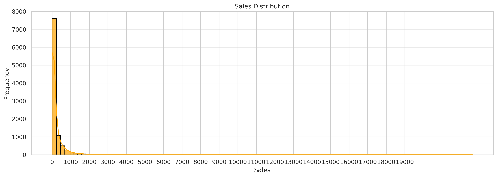
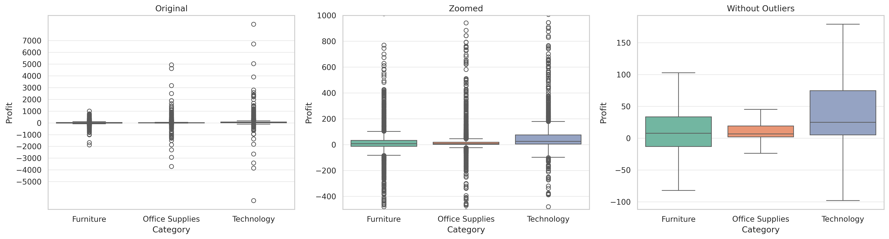
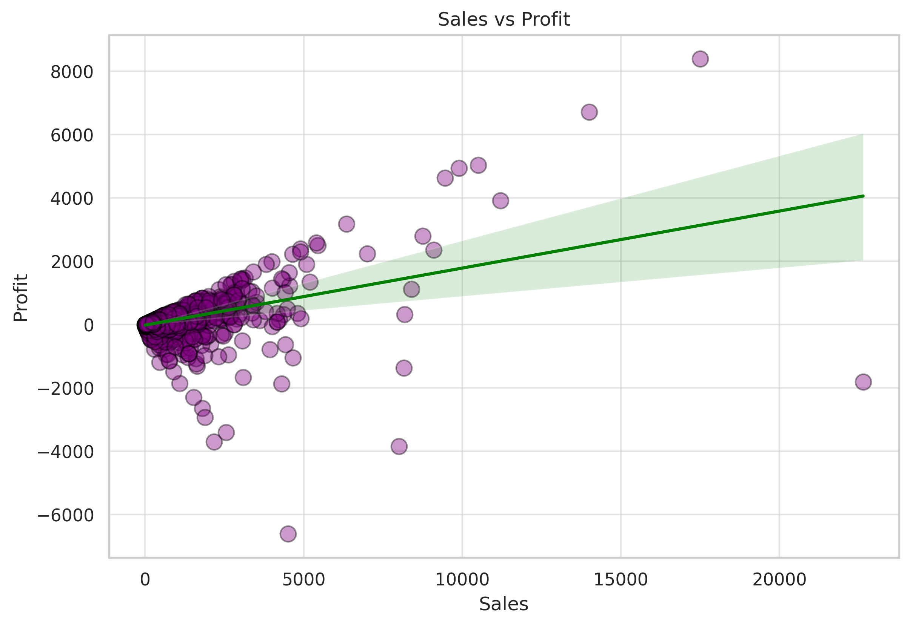
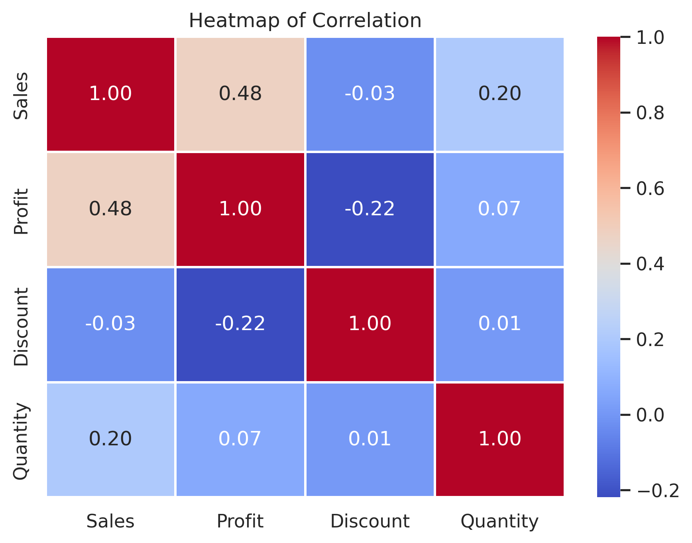

# 📊 Superstore Sales EDA

A simple exploratory data analysis project using the **Superstore retail dataset**.

The goal of this project was to practice **Pandas, Matplotlib, and Seaborn** while answering basic business questions related to **sales, profit, categories, regions, and customer segments**.

---

## 🛠️ Tools Used

* Python
* Pandas
* NumPy
* Matplotlib
* Seaborn
* Google Colab

---

## 📌 What I Analyzed

* Monthly sales trend
* Sales and profit comparison
* Sales by category and sub-category
* Regional sales performance
* Customer segment distribution
* Sales distribution
* Profit distribution by category
* Sales vs Profit relationship
* Correlation between key numerical features

---

## 📷 Key Visualizations

### Sales Distribution

### Profit Distribution by Category

### Sales vs Profit Relationship

### Correlation Heatmap

---

## 🔍 Main Insights

* Most orders are **low-value sales**.
* **Technology** is generally the most profitable category.
* **Office Supplies** has the most stable profit distribution.
* Higher sales usually lead to higher profit, but not always.
* Larger discounts tend to reduce profit.

---

## 📁 Files

* `Superstore_EDA.ipynb` — complete analysis notebook
* `images/` — saved charts used in this README

This project is part of my **Python for Data Analysis** learning journey.
